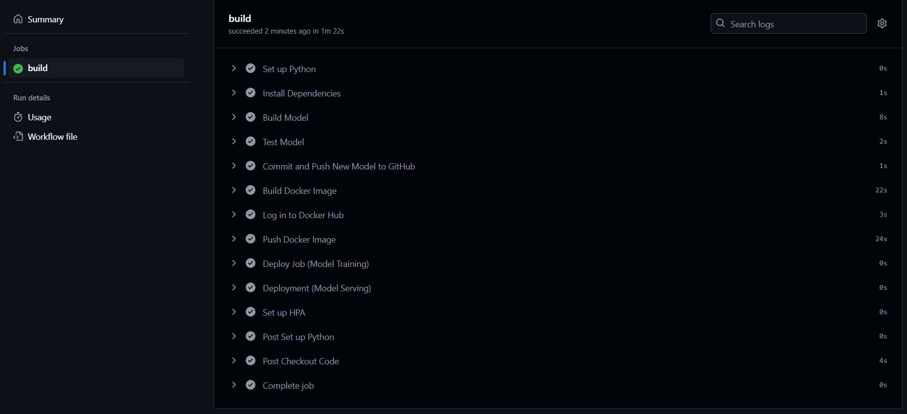
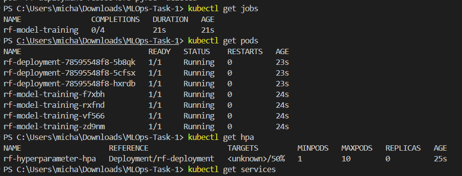
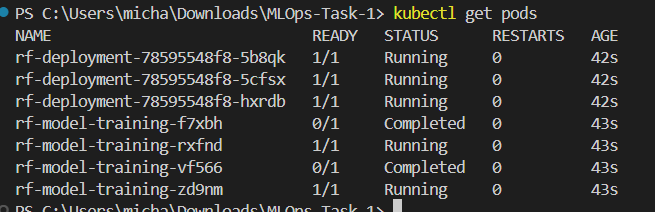
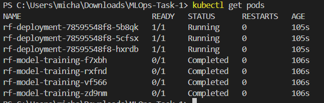

Name: Michael Tanya Hadi
Created At: 27/10/2024

# Tools
1. Docker (Hub used to store images)
2. Kubernetes
3. Python (sklearn library: RandomForest, mean_squared_error, r2_score)

## Implementation parallel hyperparameter tuning
```yaml
# Define hyperparameter ranges
param_grid = {
    'n_estimators': [10, 50, 100],
    'max_depth': [5, 10, 20],
    'min_samples_split': [2, 5, 10],
    'min_samples_leaf': [1, 2, 4]
}
```
- The code above allows user to tweak the hyperparameter ranges and everytime they push it will automatically update the pipeline and once the model is deemed better than the previous one, then and only then will it deploy within kubernetes in which
```yaml
metadata:
  name: rf-model-training
spec:
  parallelism: 4  # Number of parallel pods
  completions: 4  # Total number of pods to complete
```
- According to the code above, which is for kubernetes jobs, it will run a total of 4 pods, and 4 at the same time (parallelly).

## Instructions on how the best model will be deployed
1. Adjust the hyperparameters accordingly
2. If it (the Mean Squared Error of the model) is better or if there has yet to be a previous model then
3. It will create a "previous_rf_model.pkl" which is the current best model
    - Delete "previous_rf_model.pkl", if you want to remove the old version
4. once that passes it will build the docker image -> pushed to docker hub 
5. Finally deploying it in the kubernetes cluster

## Results

- As long as the instruction on "how the best model will be deployed" is followed, then the pipeline will succeed
---

- As you can see from above the pods are running parallelly, however the auto scaling is unknown due to the fact there has yet enough load to trigger the scaling yet
---

- Continuation of proof of parallelization
---

- Pods are fully deployed and running. However, since it is running on port 80 locally it is only accessible within the kubernetes cluster.


<br/><br/>

# Improvements to be made:
1. Add the code below for github's action runner instead of self hosting.
```yaml
- name: Log in to Docker Hub
  env:
    DOCKER_USERNAME: ${{ secrets.DOCKER_USERNAME }}  # Add this secret in GitHub
    DOCKER_TOKEN: ${{ secrets.DOCKER_TOKEN }}        # Add this secret in GitHub
  run: |
    echo "${{ secrets.DOCKER_TOKEN }}" | docker login -u "${{ secrets.DOCKER_USERNAME }}" --password-stdin
```
2. Within CI/CD, replace all kubernetes local functions to GKE and configure the KUBE_CONFIG within the secret variable in Github.
    - Why didn't i do it in a GKE? Simple, i'm a bit cautious in the worst case i burn off the credit and paid off from my card. Nevertheless, its just a matter of migrating it to a cloud service.
3. Exposing service by using a load balancer to get an external ip which makes it accessible outside the cluster.
4. Better naming conventions.
5. Seperating pipeline.yml into multiple parts for readability and scalability:
    - test.yml
    - build.yml
    - deploy.yml
6. Use a cloud storage like EC2 to store for the current version (the better version), since currently it just uses the repository itself to store for the current version of the model.

# Challenges Faced:
1. Never used kubernetes before, found it fun to use
2. My ML skills are really elementary as i have only used PyTorch using CNN & ROI Analysis
3. Inability to use GKE since i dont want to risk using my card (tend to overthink and overly cautious), can always migrate to cloud service if dire, as its just switching out a few local variables.

# Docker
docker build -t randomforest .
docker run --rm -v "$(pwd):/app" randomforest

docker login
docker tag randomforest wohousekey/randomforest:latest
docker push wohousekey/randomforest:latest

# Kubernetes
<!-- Download metrics -->
kubectl apply -f https://github.com/kubernetes-sigs/metrics-server/releases/latest/download/components.yaml

<!-- Delete all -->
kubectl delete all -all